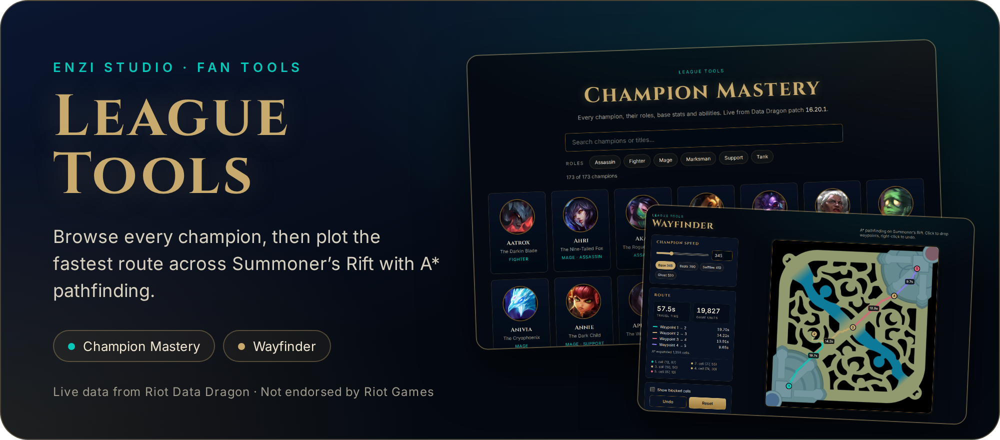
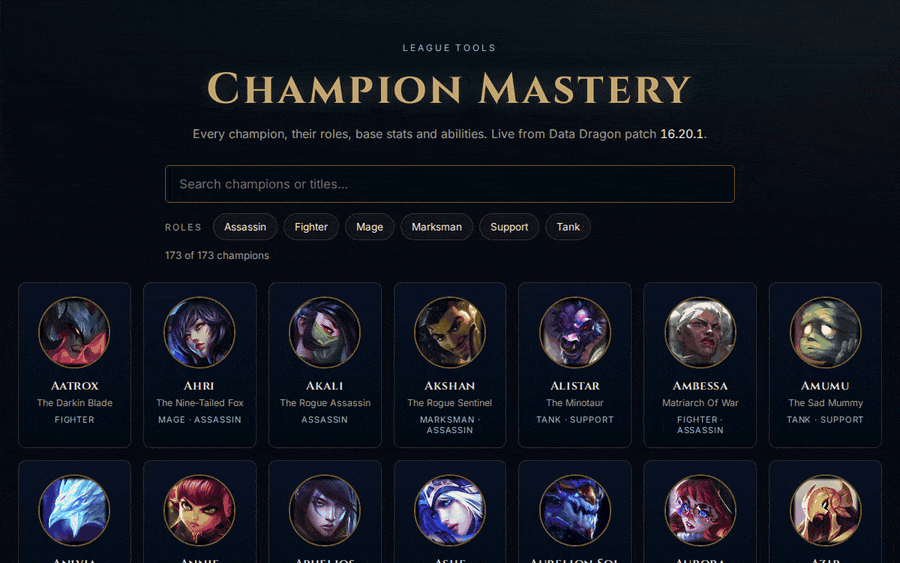
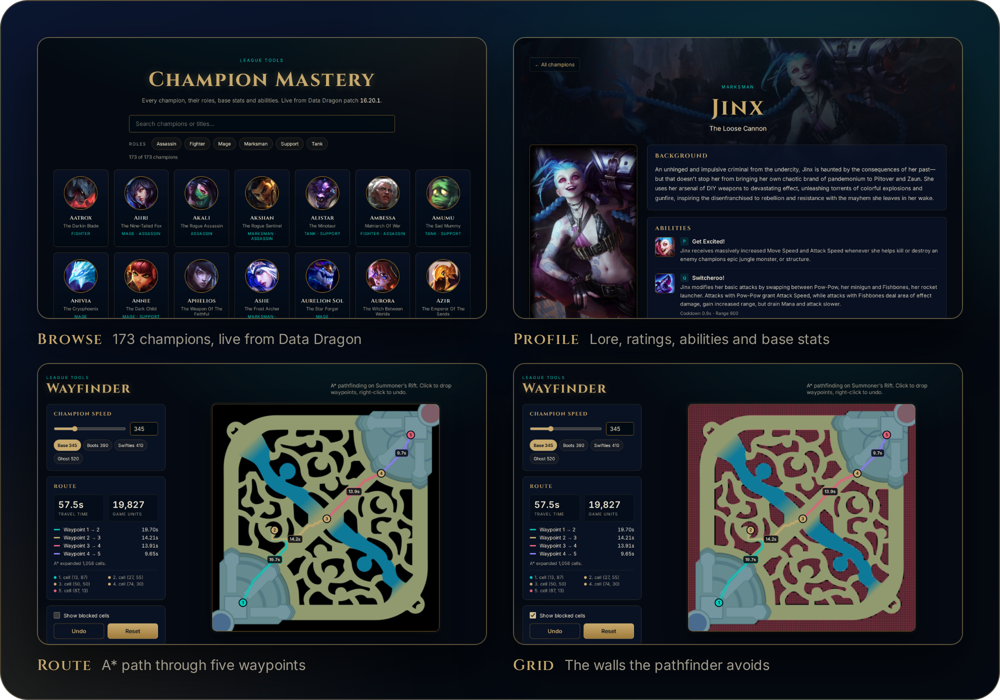
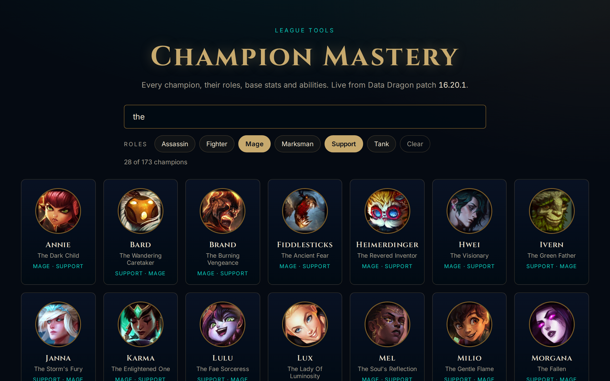
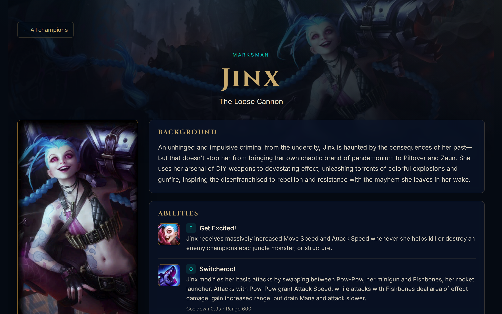
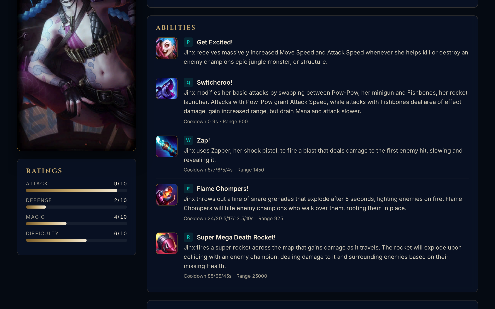
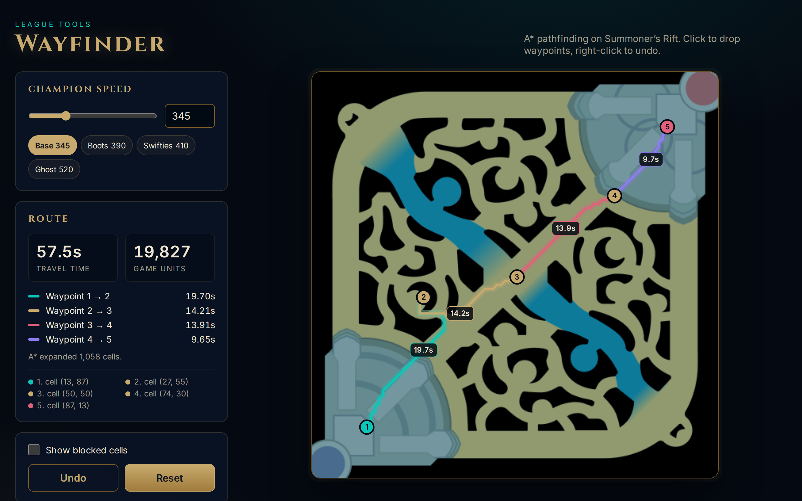
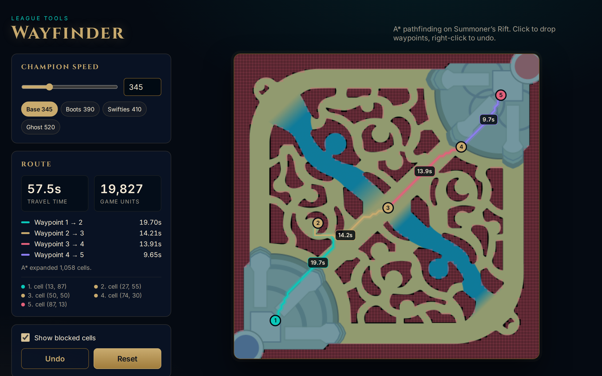
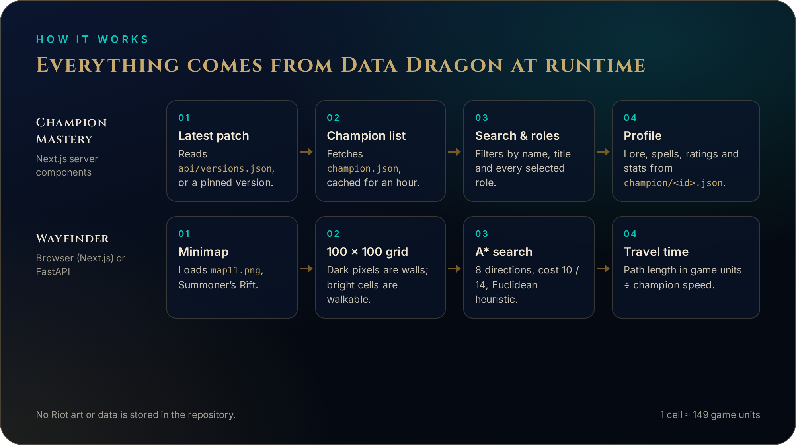

<div align="center">

<a href="#see-it-work">
  
</a>

<br>

**[Demo](#see-it-work)** ·
**[Features](#features)** ·
**[How it works](#how-it-works)** ·
**[Quick start](#quick-start)** ·
**[Configuration](#configuration)** ·
**[Legal](#legal)**

<br>

[](https://nextjs.org)
[](https://fastapi.tiangolo.com)
[](https://developer.riotgames.com/docs/lol#data-dragon)
[-785a28)](LICENSE)

</div>

Two small League of Legends fan tools in one repo. **Champion Mastery** lets you browse every champion with their roles, ratings, abilities and base stats. **Wayfinder** finds the shortest walkable route between waypoints on Summoner's Rift with A* and tells you how long a champion takes to walk it.

No Riot artwork or data is stored here. Both tools load it at runtime from Riot's public [Data Dragon](https://developer.riotgames.com/docs/lol#data-dragon) CDN, so they stay current with each patch. No API key is needed.

## See it work

<div align="center">
  
  <br>
  <sub>The real apps running locally, recorded headless with Playwright. Champion data and art come live from Data Dragon.</sub>
</div>

<br>

<div align="center">
  
</div>

## Features

### Champion Mastery: every champion, live

The grid lists every champion in the current patch (173 at patch 16.20.1). Search by name or title and filter by role. When you pick several roles, a champion must have all of them, so **Mage + Support** gives you the enchanters.



### Profiles with abilities and base stats

Each profile shows the champion's lore, Riot's attack, defense, magic and difficulty ratings, all five abilities with cooldown and range, and base stats with their growth per level. The splash and loading-screen art come straight from the CDN.





### Wayfinder: A* routes on Summoner's Rift

Click the map to drop waypoints and right-click to undo. Wayfinder chains A* between each pair and shows the time per segment, the total time and the distance in game units. Pick a speed preset (base 345, boots, Swifties, Ghost) or set any speed from 100 to 1000. If you click a wall, the nearest walkable cell is used instead.



### See what the pathfinder sees

**Show blocked cells** draws the 100 × 100 walkability grid over the map, so you can check why a route bends where it does.



### Also as a FastAPI service

`wayfinder-api/` is the original Python version. It has the same A* code, a JSON API, and a small HTML page at `/wayfinder`. Use it if you want routes from a script or a bot.

## How it works

<div align="center">
  
</div>

- **Data.** Champion Mastery uses Next.js server components to fetch `api/versions.json`, `champion.json` and `champion/<id>.json`, and caches them for an hour. Images are plain `` tags pointing at the CDN.
- **Map to grid.** Wayfinder loads Data Dragon's Summoner's Rift minimap (`img/map/map11.png`, served with CORS). It splits the map into 100 × 100 cells. A cell is walkable when at least 60% of its pixels are brighter than the near-black walls.
- **A\*.** The search uses 8 directions: straight moves cost 10 and diagonal moves cost 14. Diagonals may not cut a wall corner. The heuristic is Euclidean distance, and a binary heap holds the open set.
- **Travel time.** Path length in cells × 148.7 game units (the Rift is about 14,870 units across), divided by champion speed.

The minimap is a simplified picture of the Rift, so treat the times as good estimates, not frame-perfect numbers.

## Quick start

You need Node.js 20 or later. The API also needs Python 3.11 or later.

```bash
git clone https://github.com/enzihub/league-tools.git
cd league-tools

# Champion Mastery on http://localhost:3000
cd champion-mastery && npm install && npm run dev

# Wayfinder (web) on http://localhost:3001
cd ../wayfinder-web && npm install && npm run dev
```

Wayfinder API on http://127.0.0.1:8000/wayfinder:

```bash
cd wayfinder-api
python -m venv .venv && . .venv/bin/activate
pip install -r requirements-dev.txt
python -m pytest -q        # 4 pathfinding tests, no network needed
python main.py
```

```bash
curl -s -X POST http://127.0.0.1:8000/api/calculate-multi-path \
  -F 'waypoints=[{"x":12,"y":88},{"x":50,"y":50},{"x":88,"y":12}]' \
  -F champion_speed=345
# {"total_distance": 15982.3, "total_time": 46.33, "segment_times": [23.16, 23.16], ...}
```

The API also has `GET /api/map-data` (the walkability grid), `POST /api/calculate-path` (two points) and `GET /api/health`. FastAPI serves the docs at `/docs`.

## Configuration

Every setting is optional. Copy `.env.example` to `.env.local` (Next.js) or `.env` (API). No Riot API key is used anywhere.

| Variable | App | Default | What it does |
| --- | --- | --- | --- |
| `NEXT_PUBLIC_DDRAGON_BASE` | both web apps | `https://ddragon.leagueoflegends.com` | Data Dragon host, for a mirror or proxy |
| `NEXT_PUBLIC_DDRAGON_VERSION` | both web apps | latest | Pin a patch, for example `16.20.1` |
| `NEXT_PUBLIC_DDRAGON_LOCALE` | Champion Mastery | `en_US` | Language for names, lore and abilities |
| `DDRAGON_BASE` | API | `https://ddragon.leagueoflegends.com` | Data Dragon host |
| `DDRAGON_VERSION` | API | latest | Pin a patch |
| `HOST` / `PORT` | API | `127.0.0.1` / `8000` | Bind address |

## Repository layout

```
champion-mastery/   Next.js champion explorer (JavaScript)
wayfinder-web/      Next.js Wayfinder, runs fully in the browser (TypeScript)
wayfinder-api/      FastAPI Wayfinder with a JSON API and tests (Python)
docs/               GitHub Pages site
assets/             README images and their HTML sources (assets/src)
```

## Status

Built by Enzi Studio in 2025 and shared as-is. For this release we moved all champion data and map images to runtime Data Dragon requests and removed internal scaffolding. We also rewrote the A* code with a proper priority queue and no wall-corner cutting. Issues and pull requests are welcome, but we don't plan new features.

## Credits

Built by [Enzi Studio](https://github.com/enzihub). Contributors to the original repositories: [@RukshanJS](https://github.com/RukshanJS), [@tharindu-s-rajapaksha](https://github.com/tharindu-s-rajapaksha), [@kavishkanimsara](https://github.com/kavishkanimsara), [@ZainAli104](https://github.com/ZainAli104), [@bb-xops](https://github.com/bb-xops) and [@sun2ii](https://github.com/sun2ii).

Fonts: [Cinzel](https://github.com/NDISCOVER/Cinzel) and [Inter](https://rsms.me/inter/), both under the SIL Open Font License.

## Legal

League Tools isn't endorsed by Riot Games and doesn't reflect the views or opinions of Riot Games or anyone officially involved in producing or managing Riot Games properties. Riot Games, and all associated properties are trademarks or registered trademarks of Riot Games, Inc.

The [MIT licence](LICENSE) covers the code in this repository only. Champion names, lore, artwork, icons and the Summoner's Rift map belong to Riot Games. None of it is stored here; the apps load it from Data Dragon when they run. The screenshots in this README show that Riot art in the running apps, under Riot's [Legal Jibber Jabber](https://www.riotgames.com/en/legal) fan-use policy.
